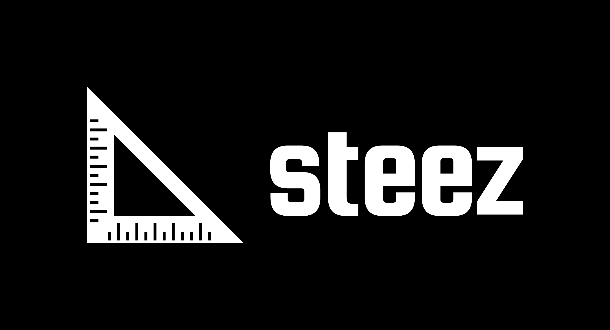

    

### Quick Start

- Install dependencies by running `yarn` or `npm install`.
- Run `yarn start` or `npm run start` to start the local dev server.

### GraphQL Resources

**dev**
[Endpoint](https://cpjvjdgvqvhyppss7d24aywwam.appsync-api.us-east-1.amazonaws.com/graphql)

### AWS Resources

[Analytics](https://us-east-1.console.aws.amazon.com/pinpoint/home/?region=us-east-1#/apps/bdf070e5d60b4d70a89d999d419f7ef5/analytics/overview)

### Login

- user: steez
- pw: v4UHe6rFDpeXK_i!
